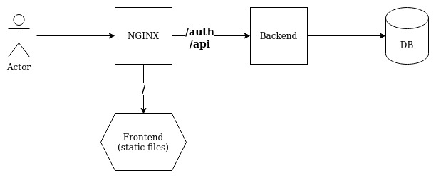

# Best practice guide


#### Running the backend behind nginx
Visual representation



1) Install the nginx webserver
```bash
yum install nginx -y
```

2) Download and extract the frontend
```bash
wget "https://github.com/OpenHausIO/frontend/releases/download/v1.0.0/frontend-v1.0.0.tgz"
mkdir -p /opt/OpenHaus/frontend-vX.X.X
tar -zxf frontend-vX.X.X.tgz -C /opt/OpenHaus/frontend-vX.X.X
cd /opt/OpenHaus
ln -snf ./frontend-vX.X.X/ ./frontend
```

3) Download and extract the backend
```bash
wget "https://github.com/OpenHausIO/backend/releases/download/v2.0.0/backend-v2.0.0.tgz"
mkdir -p /opt/OpenHaus/backend-vX.X.X
tar -zxf backend-vX.X.X.tgz -C /opt/OpenHaus/backend-vX.X.X
cd /opt/OpenHaus
ln -snf ./backend-vX.X.X/ ./backend
cd backend
export NODE_ENV=production
npm run install --prod-only
cp open-haus.service /usr/lib/systemd/system/open-haus.service
vim /usr/lib/systemd/system/open-haus.service
systemctl daemon-reload
systemctl enable --now open-haus
```
> Do not forget to edit the environment variables in the open-haus.service config!
> Set the following with custom values
> `UUID`
> `VAULT_MASTER_PASSWORD`
> `USERS_JWT_SECRET`
> See https://docs.open-haus.io/#/administration/configuration

4) Create a nginx configuration file `/etc/nginx/conf.d/open-haus.conf`:
```nginx
map $http_upgrade $connection_upgrade {
  default upgrade;
  ''      close;
}
server {

    listen 80 default_server;
    server_name 127.0.0.1 localhost open-haus.lan open-haus.local;

    # remove server version
    server_tokens off;

    root /opt/OpenHaus/frontend;

    autoindex off;    

    location = /favicon.ico { access_log off; log_not_found off; }
    location = /robots.txt  { access_log off; log_not_found off; }

    location ~ /(api|auth)/(.*)$ {
        proxy_pass http://127.0.0.1:8080/;
        proxy_http_version 1.1;
        proxy_set_header X-Forwarded-Proto $scheme;
        proxy_set_header Connection $connection_upgrade;
        proxy_set_header Upgrade $http_upgrade;
        proxy_set_header Host $host;
        proxy_set_header X-Real-IP $remote_addr;
        proxy_set_header X-Forwarded-For $proxy_add_x_forwarded_for;
    }    

    location / {
        try_files $uri $uri/ =404;
        index index.html;
    }
}
```

1) Enable autostart
```bash
systemctl enable --now nginx
systemctl status nginx
```

1) Test the configuration
```bash
curl http://127.0.0.1
```